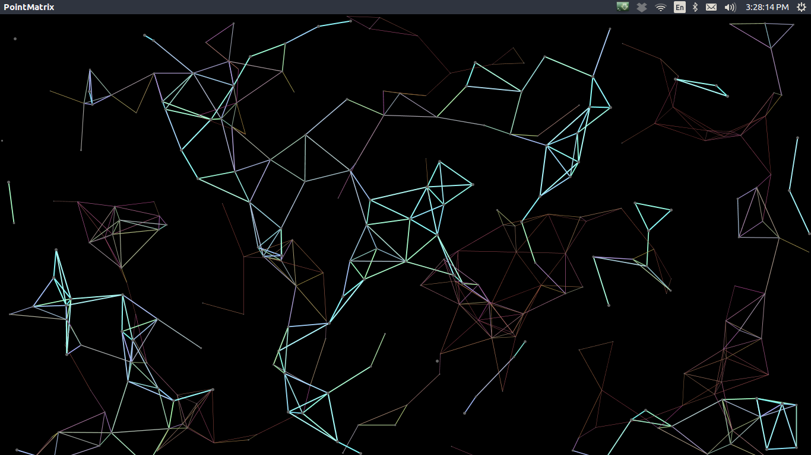
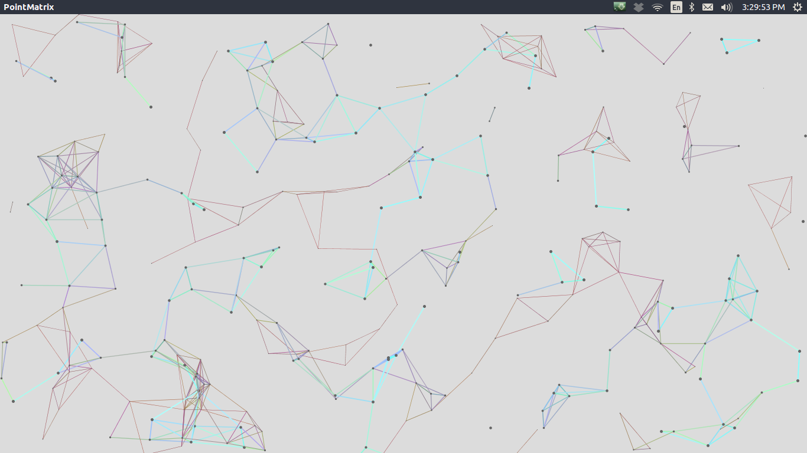
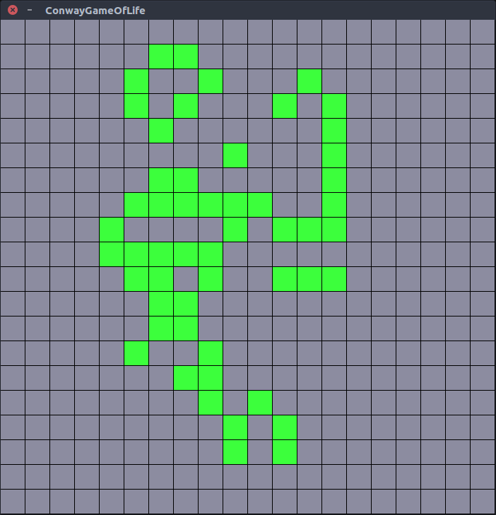
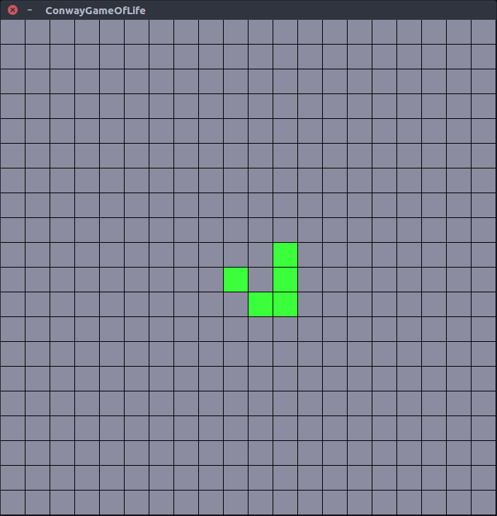

# Processing Sketches

Sketches made in Java's Processing graphics library.

## PointMatrix

Points floating across screen, connected by network of lines with surrounding neighbors based on distance. Click to toggle dark/light background.

## Conway's Game of Life

The classic Conway's Game of Life. Cells die if they have more than 3 neighbors or fewer than 2. New cell spontaneously appears if it has 3 neighbors. Click on matrix to toggle cells while game is paused. Start/stop the game by pressing spacebar.

